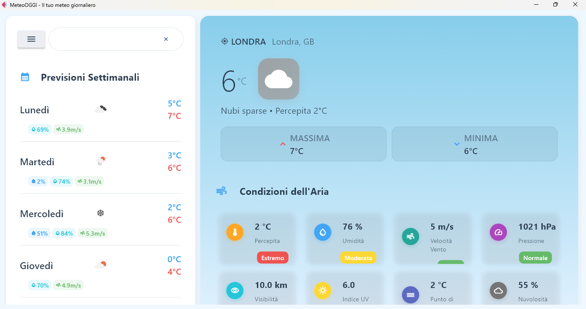
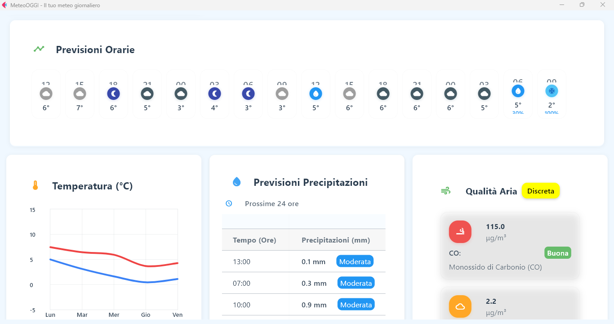
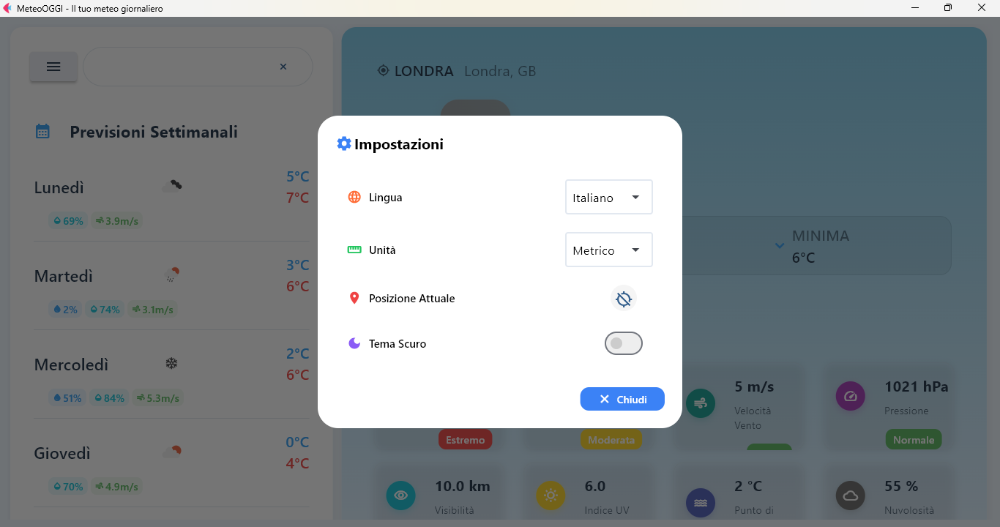

# WeatherApp


A modern cross-platform weather application built with Python, Flet, and Flutter.

## Demo 
<div>
  
  
</div>
<i>Main dashboard overview | Detailed analysis and advanced tools</i>

<br>
<br>


<i>Settings section (theme, language, units)</i>

## Current Status

- **Functionality:** Project is completed and fully operational on all supported platforms. All main features (weather dashboard, settings, charts) are working as intended.
- **Known limitations:** 
  - Layout and container structure could be optimized for better ergonomics across some screen resolutions.
  - Mobile/tablet responsiveness can be improved.
  - Some UI widgets could be streamlined for usability.
- **Roadmap / Future Improvements:**
  - Advanced layout optimization for multi-screen experience.
  - Refactoring of “settings” and “alerts” sections.
  - Possible addition of custom weather widgets and new API integrations.

## Features

- **Real-time Weather Data**: Current conditions, hourly and daily forecasts
- **Interactive Charts**: Temperature trends and precipitation forecasts  
- **Multi-language Support**: 12+ languages with automatic locale detection
- **Dynamic Theming**: Light/dark themes with automatic switching
- **Location Services**: GPS integration and city search
- **Weather Alerts**: Customizable notifications for severe weather
- **Responsive Design**: Optimized for desktop, tablet, and mobile
- **High Performance**: Async operations with intelligent caching
- **State Persistence**: Settings and preferences saved across sessions
- **Cross-platform**: Native experience on Windows, macOS, Linux, iOS, Android, and Web

## Project Structure

The project follows a modular architecture with both Python backend and Flutter frontend:

```
.
├── src/                          # Python backend source code
│   ├── main.py                   # Main application entry point
│   ├── app/                      # Application core
│   │   ├── __init__.py
│   │   └── app.py               # Alternative entry point
│   ├── assets/                   # Static assets
│   │   ├── favicon.png
│   │   ├── icon.png
│   │   ├── splash_android.png
│   │   └── flags/                # Country flag images
│   ├── core/                     # Core application logic
│   │   ├── __init__.py
│   │   ├── state_manager.py      # Application state management
│   │   └── models/               # Data models
│   ├── services/                 # Service layer
│   │   ├── __init__.py
│   │   ├── settings_service.py   # Settings management
│   │   ├── alerts/               # Weather alerts service
│   │   ├── api/                  # API services
│   │   │   └── api_service.py    # Weather API integration
│   │   ├── data/                 # Data management services
│   │   ├── location/             # Location services
│   │   ├── maps/                 # Maps integration
│   │   └── ui/                   # UI services
│   │       ├── translation_service.py  # Multi-language support
│   │       └── theme_handler.py        # Theme management
│   ├── ui/                       # User interface components
│   │   ├── __init__.py
│   │   ├── components/           # Reusable UI components
│   │   │   ├── buttons/          # Custom buttons
│   │   │   ├── cards/            # Weather cards
│   │   │   │   └── weather_card.py
│   │   │   ├── dialogs/          # Modal dialogs
│   │   │   ├── inputs/           # Input components
│   │   │   └── navigation/       # Navigation components
│   │   ├── layout/               # Layout components
│   │   │   ├── __init__.py
│   │   │   ├── sections/         # Main UI sections
│   │   │   │   ├── alerts/       # Weather alerts UI
│   │   │   │   ├── informationcharts/  # Charts and visualizations
│   │   │   │   │   ├── precipitation_chart.py  # Precipitation forecast
│   │   │   │   │   └── temperature_chart.py    # Temperature trends
│   │   │   │   ├── informationtab/     # Weather information tabs
│   │   │   │   │   ├── air_condition.py     # Air quality conditions
│   │   │   │   │   ├── air_pollution.py     # Air pollution data
│   │   │   │   │   ├── hourly_forecast.py   # Hourly forecasts
│   │   │   │   │   └── main_information.py  # Main weather info
│   │   │   │   ├── maps/          # Weather maps
│   │   │   │   ├── settings/      # Settings UI
│   │   │   │   └── weeklyweather/ # Weekly forecast
│   │   │   │       └── weekly_weather.py
│   │   │   └── sidebar/           # Navigation sidebar
│   │   ├── themes/               # Theme definitions
│   │   │   └── themes.py         # Light/dark themes
│   │   └── views/                # Main application views
│   │       └── weather_view.py   # Primary weather display
│   └── utils/                    # Utility modules
│       ├── __init__.py
│       ├── config.py             # Configuration settings
│       ├── responsive_utils.py   # Responsive design utilities
│       └── translations_data.py  # Translation data
│
├── lib/                          # Additional libraries
│   ├── models/                   # Data models
│   ├── services/                 # Service definitions
│   └── utils/                    # Utility functions
│
├── build/                        # Build artifacts and Flutter app
│   ├── flutter/                  # Flutter application
│   │   ├── lib/                  # Flutter source code
│   │   │   ├── main.dart         # Flutter entry point
│   │   │   └── python.dart       # Python integration
│   │   ├── android/              # Android platform code
│   │   ├── ios/                  # iOS platform code
│   │   ├── web/                  # Web platform code
│   │   ├── windows/              # Windows platform code
│   │   ├── linux/                # Linux platform code
│   │   ├── macos/                # macOS platform code
│   │   ├── images/               # Flutter assets
│   │   ├── pubspec.yaml          # Flutter dependencies
│   │   └── analysis_options.yaml # Flutter linting
│   ├── flutter_assets/           # Compiled Flutter assets
│   ├── flutter-packages/         # Flutter packages
│   └── site-packages/            # Python packages for mobile
│
├── storage/                      # Application data storage
│   ├── cache/                    # Cached data
│   ├── dashboard/                # Dashboard layouts
│   │   ├── current_layout.json
│   │   └── dashboard_layouts.json
│   ├── data/                     # Persistent data
│   │   └── saved_locations.json
│   └── temp/                     # Temporary files
│
├── add_dialog_translations.py    # Translation utility script
├── pyproject.toml                # Python project configuration
├── requirements.txt              # Python dependencies
└── README.md                     # Project documentation
```

## Requirements

- Python 3.7+
- Flet
- Requests
- python-dotenv

## Installation

1. Clone the repository:
```bash
git clone https://github.com/yourusername/MeteoApp.git
cd MeteoApp
```

2. Install dependencies:
```bash
pip install -r requirements.txt
```

3. Create a `.env` file in the project root with your OpenWeatherMap API key:
```
API_KEY=your_api_key_here
DEFAULT_LANGUAGE=en
DEFAULT_UNIT_SYSTEM=metric
```

4. Configure application settings by editing `src/utils/config.py` if needed.

## Running the Application

Run the application using:

```bash
python src/main.py
```

For alternative entry point, you can also use:

```bash
python src/app/main.py
```

## Development

### Architecture Overview

The application follows a clean, modular architecture:

- **Core Layer** (`src/core/`): State management and data models
- **Services Layer** (`src/services/`): Business logic and external integrations
- **UI Layer** (`src/ui/`): User interface components and views
- **Utils Layer** (`src/utils/`): Shared utilities and configuration

### Adding New Features

To add new features:

1. **API Integration**: Add new API services in `src/services/api/`
2. **UI Components**: Create reusable components in `src/ui/components/`
3. **Layout Sections**: Add new sections in `src/ui/layout/sections/`
4. **State Management**: Update state manager in `src/core/state_manager.py`
5. **Configuration**: Update settings in `src/utils/config.py`
6. **Translations**: Add new strings to `src/utils/translations_data.py`

### Key Components

- **Weather Charts**: Located in `src/ui/layout/sections/informationcharts/`
  - Temperature trends (`temperature_chart.py`)
  - Precipitation forecasts (`precipitation_chart.py`)
- **Weather Information**: Located in `src/ui/layout/sections/informationtab/`
  - Main weather display (`main_information.py`)
  - Air quality data (`air_condition.py`, `air_pollution.py`)
  - Hourly forecasts (`hourly_forecast.py`)
- **Theme System**: Managed by `src/services/ui/theme_handler.py`
- **Translation System**: Handled by `src/services/ui/translation_service.py`

### Configuration

All configuration settings are centralized in `src/utils/config.py`. The application also uses:

- `pyproject.toml` for Python project configuration
- `requirements.txt` for Python dependencies
- `.env` file for environment variables (API keys, etc.)

## License

This project is licensed under the MIT License - see the LICENSE file for details.
